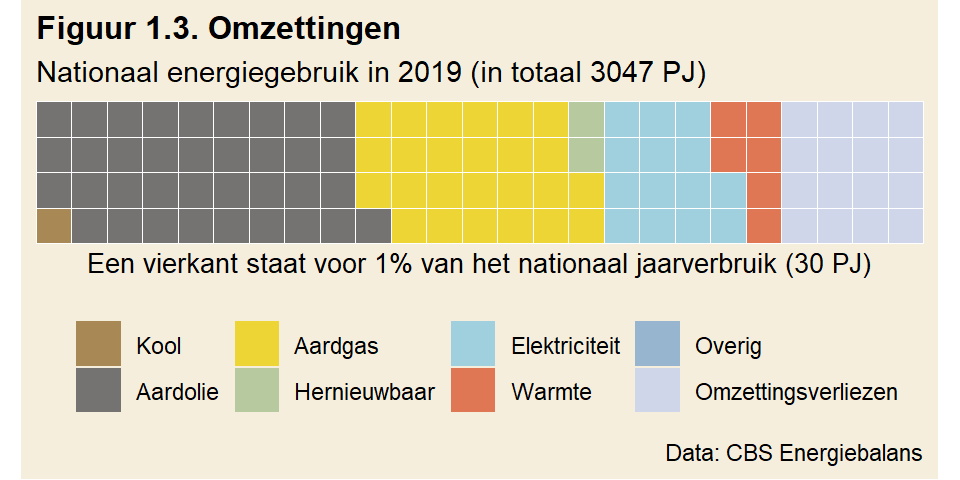

---
output:
  pdf_document: default
  html_document: default
---
# Verbruik

\noindent Als de energietransitie eenmaal voltooid is, wordt alle energie in Nederland hernieuwbaar opgewekt. Alle fossiele brandstoffen zijn dan vervangen. Hoe gaat die toekomst eruit zien? Hoeveel windmolens, zonnecellen of kerncentrales zijn daarvoor nodig? Dat antwoord is afhankelijk van de hoeveelheid energie die Nederland gebruikt.

## Bronnen

Het energieverbruik van Nederland wordt door het Centraal Bureau voor Statistiek (CBS) bijgehouden. In 2019, het jaar dat in deze tekst wordt gebruikt, was het totale energieverbruik 3047 petajoule ([Bron: CBS Energiebalans](https://opendata.cbs.nl/statline/#/CBS/nl/dataset/83140NED/table?dl=38AA0)). Figuur 1.1 neemt de data van het CBS als basis om een overzicht te krijgen van het totale verbruik. De figuur telt op tot 100%.

Wat meteen opvalt is dat fossiele grondstoffen het overgrote deel van het energieverbruik uitmaken. Nederland draait dus, nog steeds, op aardgas, aardolie en kool. In totaal nemen deze fossiele bronnen 89% van ons energieverbruik voor hun rekening.

Hoe zit het met hernieuwbare energie? In 2019 werd afgerond 8% (figuur 1.1) van onze energie duurzaam opgewekt. Figuur 1.2 toont hoeveel er door iedere hernieuwbare bron apart werd geproduceerd. Ter vergelijk is ook kernenergie, als CO~2~-vrije bron, hieraan toegevoegd. Let op bij het tellen: de schaal is nu anders. Een vierkant staat nu voor een tiende procent van het nationaal energieverbruik.

Uit figuur 1.2 blijkt dat ruim een procent van ons energieverbruik wordt opgewekt door windenergie. Zonne-energie telt mee voor minder dan een procent en biomassa is goed voor ruim vijf procent. Wie kernenergie wil meerekenen, kan er nog een procent bij optellen.

Het grootste deel van de hernieuwbaar opgewekte energie komt dus voort uit [biomassa](https://longreads.cbs.nl/hernieuwbare-energie-in-nederland-2019/biomassa/). Biomassa bestaat onder andere uit hout- en afvalverbranding, en biotransportbrandstoffen die verplicht in benzine wordt ingemengd. Biomassa komt in oorsprong voort uit gewasgroei. De energiedichtheid van gewassen is laag in vergelijk met bijvoorbeeld de opbrengst van zonne- en windenergie (Zie [MacKay](https://www.withouthotair.com/download.html), p43, figuur 6.11). Op onze breedte kan zonne-energie 20 W/m^2^ leveren. Vergelijk dat met gewassen: MacKay gaat uit van 0,5 W/m^2^ voor 'energy crops', o.a. hout. Biomassa concurreert rechtstreeks met landbouw of natuurgebied. In combinatie met de lage opbrengst per vierkante meter is het geen ideale vorm van brandstof. 

Met kernenergie meegerekend als CO~2~-vrije bron, is uiteindelijk 9% van het nationale energieverbruik CO~2~-vrij. Wil Nederland straks al zijn energie groen opwekken, dan is er dus nog een weg te gaan.

## Omzettingen

De energiebronnen zoals opgesomd in figuur 1.1 worden door het CBS geclassificeerd als 'aanbod'. Deze bronnen worden verder verwerkt. Een deel ervan wordt niet rechtstreeks gebruikt door afnemers, maar eerst omgezet in andere vormen van energie. Aardgas en kolen worden bijvoorbeeld deels omgezet in elektriciteit. Het resultaat van de omzetting wordt in Figuur 1.3 inzichtelijk gemaakt.

Elektriciteit maakt na omzetting 14% uit van ons energieverbruik. Deels wordt dat al groen opgewekt, en deels vertegenwoordigt dat indirect gebruik van fossiele brandstoffen. Daarnaast is er direct verbruik door afnemers: voor 36% van het totale energieverbruik wordt aardolie gebruikt en voor 25% aardgas.

De gegevens in de energiebalans maken de omzettingen helaas niet expliciet. Er is niet af te leiden hoe bijvoorbeeld de 8% hernieuwbare energie uit figuur 1.1 wordt omgezet. In figuur 1.3 resteert slechts 2% 'hernieuwbaar'. De overige 6% is omgezet in andere vormen van energie, bijvoorbeeld elektriciteit.

## Afnemers

Door wie worden al deze verschillende energievormen verbruikt? Het CBS houdt dat in de energiebalans voor iedere sector bij. Het wordt samengevat in figuur 1.4. Hierbij wordt de naamgeving van het CBS gevolgd, waarbij nadruk is gelegd op de grote verbruikers. Er kan weer geteld worden in de figuur: ieder vierkant staat voor een procent van ons nationaal jaarverbruik. De oplettende lezer merkt op dat de figuur optelt tot 84%, dat komt omdat omzettingsverliezen niet meer meetellen.

Figuur 1.4 geeft een beeld door wie de verschillende energiebronnen worden verbruikt. Ons vervoer draait op aardolie en is goed voor 15% van ons energieverbruik. Veel aardolie en ook wat aardgas gaan in het maken van producten (niet-energetisch gebruik, 17%). Een fors deel van de bronnen wordt dus gebruikt om producten te maken. Denk bijvoorbeeld aan alles wat van plastic gemaakt wordt, maar er zijn natuurlijk vele andere voorbeelden. Huishoudens (categorie 'Woningen') verbruiken 13% van onze energie. Dat is voornamelijk aardgas, gebruikt voor verwarming. Dat zijn zo'n beetje de grote verbruikers.

## Verbruik

Met welk energieverbruik moet men rekenen? Hoe groot was het energieverbruik van Nederland in 2019?

De energiebalans van het CBS somt energiedragers op, hoeveel van de drager gebruikt wordt en waarvoor. Een deel van de energiedragers wordt gevormd door grondstoffen, zoals aardolie of aardgas. Een ander deel van deze grondstoffen wordt *niet* gebruikt voor de opwekking van energie, het zogenaamde 'niet-energetisch gebruik'. Deze grondstoffen worden voornamelijk gebruikt voor producten. Trekt men dat af van het totaal, dan gebruikte Nederland in 2019 voor 2551 petajoule aan bronnen puur voor de opwekking van energie.

Hoeveel is dat, 2551 petajoule? Volgens het CBS (zie toelichting op de energiebalans): Petajoule (PJ) is een eenheid voor energie. Dit is 1 000 000 000 000 000 joule (een 1 met 15 nullen). Eén PJ komt overeen met 31,6 miljoen kubieke meter aardgas of 278 miljoen kilowattuur elektriciteit.

Hernieuwbare bronnen leveren vaak elektriciteit. Het is dus praktisch om het nationaal verbruik uit te drukken in een eenheid die veel wordt gebruikt bij elektriciteitsproductie. De terawattuur past daarbij het best als het gaat om het energieverbruik van een heel land (tera staat voor een 1 met 12 nullen). Omgerekend verbruikte Nederland in 2019 in totaal 706 TWh aan energie. Wie 706 TWh in een energieopslag heeft zitten, kan Nederland een jaar van energie voorzien. Gesteld dat de nationale energievraag constant is, verbruikt Nederland continu zo'n 81 GW aan energie (706 TWh / (365d \* 24h) = 0,081 TW = 81 GW). Energiecentrales met een gezamenlijk vermogen van 81 GW kunnen Nederland permanent van energie voorzien.   

## Transitie

Wat worden de energiedragers van de toekomst? Daar lijken twee kandidaten voor te zijn: elektriciteit en waterstof, gemaakt van elektriciteit. De energietransitie is in die zin een transitie van fossiele brandstoffen naar elektriciteit. Processen die nu fossiele brandstoffen gebruiken, moeten omschakelen naar elektriciteit. De vraag is of dat in alle gevallen kan en de beste oplossing is.

Aangezien elektriciteit de energiebron van de toekomst is, ligt het voor de hand zoveel mogelijk processen te elektrificeren. Waterstof moet eerst geproduceerd worden, een proces dat op zichzelf energie kost. Elektriciteit gebruiken is dus in beginsel efficiënter. Daarnaast maakt elektrificatie in sommige gevallen het proces er efficiënter op. Dat zou meteen een besparing op het energieverbruik opleveren. 

Persoonlijk vervoer is een goede kandidaat voor elektrificatie. Als het zou lukken ieder voertuig elektrisch te laten rijden, zou dat een besparing van 80% op ten opzichte van de verbrandingsmotor kunnen opleveren ([MacKay, p127](https://www.withouthotair.com/download.html)). Dat is meteen een aanzienlijke besparing ten opzichte van het totaal, want vervoer gebruikt 15% van onze energie (figuur 1.4). Dit zou dus een besparing van 12% op ons totale energieverbruik opleveren. Tenminste, als al het verkeer ge-elektrificeerd kan worden, maar dat lijkt met vrachtverkeeer niet het geval.

Een andere categorie waar winst valt te behalen, is 'Woningen'. Het grootste verbruik hier is aardgas (9%, zie figuur 1.4). Dat wordt voornamelijk gebruikt voor het verwarmen van huizen. Het kiezen voor een andere manier van verwarming, namelijk via warmtepompen, levert ook een besparing op. Een warmtepomp (een omgekeerde ijskast) kan een efficiëntie halen van 400% of meer. Dat klinkt gek, maar een warmtepomp kan voor 1 kWh aan stroom 4 kWh aan warmte de kamer in krijgen ([MacKay, p147](https://www.withouthotair.com/download.html)). Aangenomen dat verwarming via gas 100% efficiënt is (wat niet gehaald wordt), kan hier (maximaal) een besparing van 75% behaald worden. Dat zou betekenen dat hier een dikke 6% besparing ten opzichte van het totale verbruik valt te behalen.

Zo bezien valt er dus best wat te besparen door efficiëntieverbeteringen, zonder dat daarbij aan comfort wordt verloren. Er zijn echter nog andere verbruikers te vinden in figuur 1.4: Chemie (5% fossiel), Diensten (4%), (overige) Nijverheid (4%), de Energiesector (4%) en Landbouw (2%). Hoeveel van deze sectoren uiteindelijk ge-elektrificeerd kunnen worden is hier niet verder uitgezocht. Sommige zaken die niet ge-elektrificeerd kunnen worden, of waar het op z'n minst inefficiënt is, zijn industriële processen waarbij hoge temperatuur nodig is, vrachtvervoer, luchtvaart en openbaar vervoer (zie bijv. [hier](https://energypost.eu/which-sectors-need-hydrogen-which-dont-transport-heating-electricity-storage-industry/)). Voor deze zaken ziet men waterstof als oplossing. 

'Producten' (niet-energetisch gebruik, 17% fossiel) is in dit plaatje een beetje een buitenbeentje. Afhankelijk van hoe hier tegenaan wordt gekeken, moet dit brongebruik ook vergroend worden of kan het juist buiten beschouwing worden gelaten. Vanuit de optiek dat alle fossiele brandstoffen vervangen moeten worden, omdat deze ooit uitgeput raken, zal ook dit fossiel gebruik moeten worden vervangen en dus worden meegeteld in de energierekening. Deze vervanging gaat waarschijnlijk juist meer energie vergen dan nu het geval is. De koolwaterstoffen die er nu voor worden gebruikt zijn in feite al 'op voorraad', maar in de toekomst zullen deze moeten worden geproduceerd. Dat kost ongetwijfeld energie.

Een ander gezichtspunt is dat, aangezien productgebruik geen CO~2~ uitstoot en de voorraad voorlopig niet uitgeput zal raken, dit kan worden weggestreept en aan toekomstige generaties kan worden overgelaten. Beide zienswijzen hebben hun merites. De berekeningen zullen uitgaan van alleen het energetisch gebruik.

Wat verder opvalt is het aandeel omzettingsverliezen (figuur 1.3), dat 16% uitmaakt. Als deze verliezen bij verdere elektrificatie van de maatschappij voorkoombaar zouden zijn, dan levert dat in feite een besparing op. 

Hoeveel er in de toekomst ge-elektrificeerd kan worden blijft de vraag. Het lijkt in elk geval aannemelijk dat er zowel elektriciteit als waterstof nodig zullen zijn. 

## Besparen

Besparen op ons energieverbruik wordt gezien als een deel van de oplossing van de energietransitie. Dat is logisch: een direct gevolg van besparingen is dat er minder CO~2~ wordt uitgestoten. Een ander bijkomend voordeel is dat er minder energie vervangen hoeft te worden, en dat scheelt infrastructuur. Voor zover besparingen voortkomen uit efficiëntieverbeteringen, levert dat alleen maar winst op. Er wordt niets voor ingeleverd. Een LED-lamp is zuiniger dan een gloeilamp. Er komt evenveel licht uit, maar het verbruikt minder stroom. 

Efficiëntieverbeteringen zijn echter eindig. De andere manier om het energieverbruik te verminderen, is om te bezuinigen door dingen te laten. Er wordt dan in feite welvaart ingeleverd. In termen van het voorbeeld van zoëven: er worden minder lampen aangedaan in huis. Of dat er minder treinen rijden, of de reis langer duurt. Of dat er bij ziekte minder vaak een MRI wordt gemaakt. 

Op zich is er niets mis met meer energie gebruiken, zolang het schoon en duurzaam geproduceerd wordt. Een bezuiniging kan tijdelijk van aard zijn, bijvoorbeeld om uitstoot te verminderen. Als een bezuiniging onderdeel van de oplossing wordt, zijn de gevolgen groter. Een permanente verkleining van het energiebudget sluit energieafhankelijke innovatie uit. Denk bijvoorbeeld aan het terugvangen en opslaan van CO~2~ (*direct air capture*). (Een proeffabriek in IJsland is net operationeel geworden. Het geeft de mogelijkheid een [abonnement](https://climeworks.com/subscriptions) te nemen om CO~2~ uit de lucht te laten verwijderen.) Als DAC werkelijkheid zou worden, zal het in elk geval energetisch kostbaar zijn ([MacKay](https://www.withouthotair.com/download.html), p244). Voor het inzetten van *Urban agriculture* om de negatieve effecten van intensieve landbouw te verminderen, geldt dat ook. Big data, betere gezondheidszorg, waterstof produceren als schone brandstof, irrigratie in gebieden die te droog zijn (door desalinatie van zeewater). Ook dat kost allemaal veel energie. Het zijn een paar voorbeelden die nu voorstelbaar zijn, maar vooruitgang gaat eigenlijk juist over de dingen die we nu nog niet weten, maar ons veel kunnen opleveren. Wie ziek is, denkt niet graag terug aan een wereld zonder moderne gezondheidszorg. Daarbij gaat het ook om wat wij toekomstige generaties aan vooruitgang in welvaart gunnen. 

Hoe ver is Nederland nu met besparen? Er worden al geruime tijd efficiëntiemaatregelen getroffen om besparingen te realiseren, zoals het isoleren van huizen. Een ander voorbeeld is de verplichting aan bedrijven om te bezuinigen op energie, als dat mogelijk is. Hoe ver zijn we al met de reductie van ons energiegebruik? Figuur 1.5 toont het verloop van ons energiegebruik over de afgelopen jaren. Het ijkjaar in de figuur is 2007, waar het gebruik op 100% werd gesteld. Ten opzichte van dat jaar werd er in 2019 8% minder energie gebruikt.

