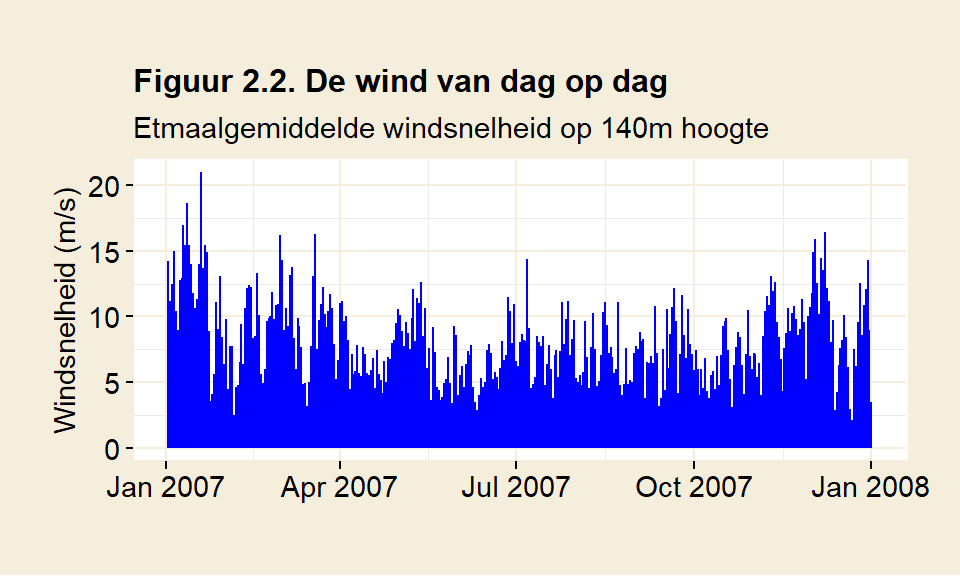
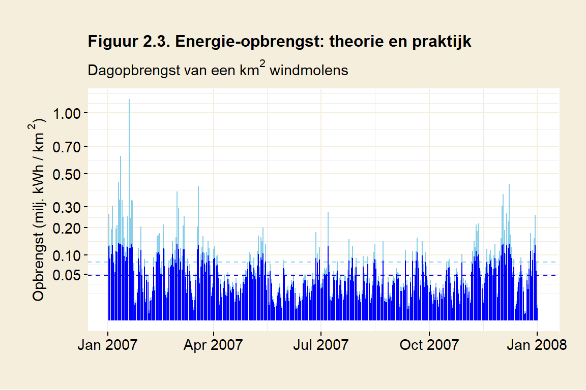
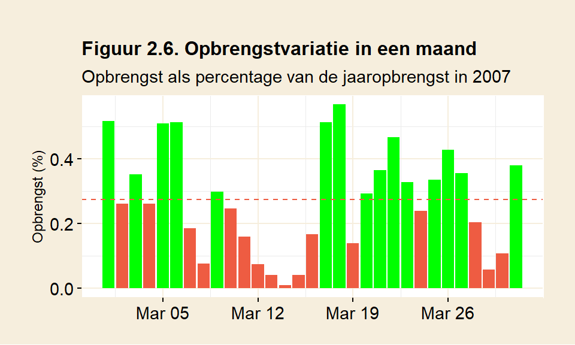

# Windenergie 

Dit hoofdstuk schat de energieopbrengst en het ruimtegebruik van windmolens. Daarnaast wordt gekeken welk effect de onregelmatige opbrengsten uit wind hebben op de betrouwbaarheid van de energievoorziening.

## Energie uit wind

Windmolens halen energie uit bewegende lucht. Meer wind betekent meer energie. De toename is exponentieel (de basisformule om dat te berekenen is $\frac{1}{2} \rho v^3$ ([MacKay](https://www.withouthotair.com/download.html), p263. Zie ook bijlage A1)). Als de wind toeneemt van een windkracht twee (2 m/s) naar een windkracht drie (4 m/s) dan wordt de potentiële opbrengst verachtvoudigd, in plaats van verdubbeld. Een molen die staat op een plek waar het harder waait, ook al is dat weinig, wordt beloond. 

Kijk eens naar figuur 2.1. Daar wordt de gemiddelde windsnelheid weergegeven voor een aantal meetmasten in Nederland (bron: [KNMI, Windkaart van Nederland op 100m hoogte](https://www.knmiprojects.nl/binaries/knmiprojects/documents/publications/2014/12/01/knmi-windkaart-van-100-m-hoogte/KNMI+-+Windkaart+van+100+m+hoogte.pdf)). Voor alle masten geldt dat het op grotere hoogte harder waait. Eerste conclusie: hogere windmolens brengen meer op. Meetmast Cabauw staat op land, nabij Utrecht. OWEZ staat op zee. Interessant is dat het windprofiel op zee verschilt met dat in het binnenland. Boven land wordt de wind aan het oppervlak meer afgeremd. De windsnelheid neemt de eerste honderd meter snel toe, om daarna af te vlakken. Het is dus een goed idee om de molens op land in elk geval hoger dan 100m te maken. Op zee is het effect minder duidelijk.

De exponentiële toename van energie maakt het berekenen van de opbrengst van een windmolen er niet makkelijker op. Stel dat men de opbrengst over twee dagen wil berekenen. Op de eerste dag waait het 2 m/s en op de tweede dag 4 m/s. Omdat de windsnelheid in de formule tot de derde macht wordt verheven, is het middelen van windsnelheid niet zo'n goed idee. Rekent men met de gemiddelde windsnelheid (3m/s) dan geeft dat als uitkomst $3^3 = 27$. Berekent men beide dagen apart, dan wordt de opbrengst hoger: $\frac{2^3 + 4^3}{2} = 36$. Dit verschil neemt toe naarmate de periode waarover men middelt langer wordt.

Rekenen met de gemiddelde windkracht onderschat dus de totaalopbrengst. Het is beter om meetgegevens te gebruiken met een korte periode, in plaats van te rekenen met jaargemiddelden. Het KNMI heeft langjarige gegevens voorhanden die de windsnelheid in tijdsvakken van tien minuten weergeven ([KNMI Data Platform](https://dataplatform.knmi.nl)). De berekeningen die volgen maken gebruik van deze fijnmazige data.

Figuur 2.2 laat de windsnelheid voor een heel jaar zien. De gebruikte data is afkomstig van KNMI's meetmast in Cabauw, nabij Utrecht. De metingen werden gedaan op 140 meter hoogte. Om de figuur enigzinds overzichtelijk te houden is de tienminutendata teruggebracht tot daggemiddelden. Hoewel dit de snelheidsverschillen afvlakt, is er duidelijk variatie in de windsnelheid te zien. 

De variatie in de windsnelheid wordt uitvergroot in de opbrengst. Verschil in windkracht leidt tot een nog groter verschil in opbrengst. Een exploitant van een windmolen moet rekening houden met pieken en dalen. Misschien geeft een bepaalde molen bij windkracht vier een mooie opbrengst. Deze windkracht staat er in werkelijkheid zelden. Bij een windkracht twee brengt de molen veel minder op. Bij een windkracht zes leidt het juist tot veel vermogen. Energietekorten, maar ook overschotten, worden zo uitvergroot. De uitschieters van 15 m/s in figuur 2.2 brengen in theorie zes keer meer op dan de gemiddelde windsnelheid over 2007 (8 m/s). Zakt de wind naar 4 m/s, dan blijft er slechts een achtste van de opbrengst over.

Windkracht heeft dus een grote invloed op de opbrengst van een molen. Verderop wordt ingegaan op hoe windsnelheid door een windmolen vertaald kan worden in opbrengst. 

Daarnaast is er een tweede factor die grote invloed heeft op de opbrengst. Windmolens staan doorgaans bij elkaar, in een windpark. Molens die in elkaars buurt staan, vangen wind van elkaar af. De bovenwindse molens verstoren de lucht voor benedenwindse molens. Dat verlaagt de efficiëntie van het park. 

Een belangrijke maat daarbij is de separatieafstand: de afstand tussen de molens in wiekdiameters. Om dezelfde separatie te behouden, moeten molens met grotere wieken verder uit elkaar worden geplaatst. Twee verschillende windparken met dezelfde separatieafstand zijn even efficiënt. De wiekdiameter van de gebruikte molen maakt daarbij niet meer uit. (Zie ook bijlage A1.) 

Een alleenstaande molen heeft geen last van verstoring, en brengt dus meer op dan een molen in een park. Uit onderzoek van [Meyers &  Meneveau](https://www.researchgate.net/publication/230284417_Optimal_turbine_spacing_in_fully_developed_wind_farm_boundary_layers) blijkt dat het efficiëntieverlies in een windpark een factor is om rekening mee te houden. *Horns Rev* is een windpark op zee in Denemarken. Uit metingen daar blijkt dat een molen in het park slechts 60% van de opbrengst realiseert in vergelijk met een alleenstaande molen. De molens in *Horns Rev* hebben een separatieafstand van zeven wiekdiameters. Dat is [vrij normaal voor een windpark](https://en.wikipedia.org/wiki/Wind_turbine#Wind_turbine_spacing). Uit het onderzoek van Meyers &  Meneveau blijkt dat een afstand van vijftien wiekdiameters optimaler zou zijn. Om de verstoring verwaarloosbaar te krijgen, moeten de molens op een afstand van meer dan honderd wiekdiameters staan. 

Als windenergie een betekenisvolle bijdrage wil leveren, dan moet er rekening gehouden worden met dit efficiëntieverlies. Enkele windmolens op een dijk volstaan dan niet meer. De ruimte zal nuttig gebruikt moeten worden en dat betekent plaatsing in twee dimensies: een windpark.

Lees voor een uitgebreide beschrijving hoe de (theoretische) opbrengst uit windmolens berekend wordt bijlage A1. 

## De energieopbrengst van windmolens

Tot zover is het verhaal voornamelijk theoretisch. Nu nemen we een stapje richting de praktijk. Voor het berekenen van de opbrengst van windmolens gaat gebruik gemaakt worden van het opbrengstprofiel van een bestaande windmolen, de Enercon-126. Deze molen wordt bijvoorbeeld gebruikt in  ([Windpark Noordoostpolder](https://www.windparknoordoostpolder.nl/)), op de dijk bij Urk. Het zijn enorme molens. De doorsnede van de mast is bij de grond 14,5 meter. Daar kan een stadsbus ruim in geparkeerd worden. De molens zijn 200 meter hoog.  

Een windmolen heeft in de praktijk een lagere opbrengst dan de theorie voorspelt. Er zijn in de praktijk natuurlijk efficiëntieverliezen, bijvoorbeeld door frictie in de aslagering, maar de grootste handicap is dat windmolens worden ontworpen op een bepaald windbereik. Binnen dat bereik is de molen efficiënt en wordt de theorie redelijk benaderd. Buiten dat bereik neemt de opbrengst snel af. (In bijlage A.2, *windmolens in de praktijk*, wordt uitgebreid beschreven hoe de opbrengstberekening tot stand komt.)  

Om de opbrengst van een windmolen te simuleren, wordt gebruik gemaakt van een opbrengstcurve (in dit geval van de Enercon-126, zie bijlage A2). Een opbrengstcurve geeft voor iedere windsnelheid weer hoeveel energie de molen kan leveren. Daarvoor kan de data van de KNMI worden gebruikt. Die geeft de gemiddelde windsnelheid over een tijdsvak van tien minuten. Uit de data wordt de windsnelheid op 140 meter hoogte gekozen, ongeveer de ashoogte van de Enercon-126. Aan de hand van de curve wordt dan vervolgens de opbrengst in het tijdsvak bepaald. Voor de berekening is aangenomen dat de windmolens onderling een separatieafstand hebben van 7 wiekdiameters. Dat brengt de efficiëntie van het windpark op 60%. De opbrengst van het veld met windmolens wordt daarop aangepast.   

De windsnelheden uit figuur 2.2 kunnen daarmee worden omgerekend in een energieopbrengst. Figuur 2.3 geeft die opbrengst weer. Zowel theorie als (gesimuleerde) praktijk worden getoond (Voor de berekening van de theoretische opbrengst, zie bijlage A1).  

Op dagen met veel wind blijft de productie in de praktijk ver achter op de theoretische opbrengst (Let op: de schaalverdeling in figuur 2.3 is niet lineair. De verschillen lijken kleiner dan ze in werkelijkheid zijn). Vergelijk bijvoorbeeld eens de grootste dagopbrengst van de gesimuleerde Enercon-126 (in blauw) in figuur 2.3 met de theoretische opbrengst (in lichtblauw): 0.14 miljoen kWh per vierkante kilometer ten opzichte van 1.13 miljoen kWh. Het volle potentiëel kan niet worden gerealiseerd. Een windmolen in de praktijk brengt volgens deze berekening iets meer dan de helft op van een ideale windmolen (0.05 tegen 0.08 miljoen kWh per km^2^). Je zou zeggen dat er dus ruimte voor verbetering is, maar dat valt tegen. Een ontwerper van een windmolen zit vast aan een bepaald windbereik. Huidige molens zijn *in dat bereik* al heel efficiënt. Een grote verbetering in opbrengst valt dus niet te verwachten.  

## Ruimtegebruik

Figuur 2.3 toont een jaar met de dagopbrengsten van een vierkante kilometer met windmolens. Door alle dagen op te tellen, kan er een
jaaropbrengst worden berekend. Nu toont figuur 2.3 alleen 2007, zomaar een willekeurig jaar. Het nemen van een langere periode geeft een betere
schatting van gemiddelde jaaropbrengst. Als de computer de opbrengst berekent in de periode van 2006 tot en met 2015, dan blijkt de
gemiddelde jaaropbrengst uit te komen op 16 miljoen kWh per km^2^.

Stel nu dat we *alle* energie in Nederland zouden willen opwekken met wind. Daarbij wordt niet alleen het elektriciteitsgebruik, maar ook
fossiele brandstoffen meegenomen. Alles is gedekt: niet alleen gezinnen worden van energie voorzien, ook de gehele industrie, het vervoer, de
overheidsdiensten, alles. Dat verbruik kwam voor 2019 in totaal neer op 706 TWh, zoals werd toegelicht in hoofdstuk 1
(Verbruik).

In dit scenario is er dan, om Nederland van energie te voorzien, een oppervlakte van

$$ \frac {706 \; miljard\; kWh} {16 \;miljoen\;kWh / km^2} = 42966 \; km^2$$
\noindent nodig. Nederland beslaat [41873 km^2^](https://nl.wikipedia.org/wiki/Nederland). Om energiedekkend te
worden met windenergie moet dan

$$ \frac {42966 \; km^2} {41873 \; km^2} = 103 \%$$
\noindent van Nederland ruimte bieden aan windmolens. Dat is meer landoppervlak dan Nederland heeft, en daarbij werden Waddenzee,
IJsselmeer en Zeeuwse stromen meegerekend. Op dit oppervlak zouden dan zo'n 54000
molens moeten staan. Het berekende oppervlakte is precies genoeg om Nederland van energie te voorzien, tenminste als men fluctuaties in de
energievoorziening buiten beschouwing laat.

Windmolens kunnen ook op zee worden geplaatst. De KNMI heeft daar helaas geen fijnmazige data voorhanden, dus het is hier niet
berekend. Een grove schatting van de opbrengst valt te geven door te kijken naar het verschil in windsnelheid tussen land en zee. Daarvoor
kan figuur 2.1 worden gebruikt. Op 140m hoogte heeft OWEZ, de locatie op de noordzee, een gemiddelde windsnelheid van
10.1 m/s. Cabauw geeft voor de zelfde hoogte
7.8 m/s. Op zee zou men dan een twee keer grotere opbrengst verwachten (10.1^3^ /
7.8^3^ =
2.2), aangenomen dat de windfluctuaties ongeveer
hetzelfde zijn op beide locaties.

De installatie zou in dat geval met de helft kunnen worden verkleind. Volgens een [schatting op
wikipedia](https://nl.wikipedia.org/wiki/Windturbines_in_Nederland) is 40% van het continentale plat, oftewel 23.000 km^2^, beschikbaar voor
plaatsing van windmolens. Het continentale plat zou dan ongeveer volgeplaatst zijn, in het geval alle energie van zeewind zou komen.

Plaatsing op zee heeft wel zijn eigen uitdagingen. De zee vormt een corrosieve omgeving waardoor het onderhoud toeneemt. De bereikbaarheid
is aanzienlijk slechter dan op land. Deze zaken zorgen ervoor dat windmolens op zee duur zijn. Volgens de US Energy Information
Administration is wind op zee bijna drie keer duurder dan op land, drie keer duurder dan gascentrales, en anderhalf keer duurder dan kernenergie
([EIA Annual Energy Outlook 2020, tabel 1b, pg7](https://www.eia.gov/outlooks/aeo/pdf/electricity_generation.pdf)).

## Opbrengstfluctuaties

Als heel Nederland voorzien wordt van windmolens kan er dus *gemiddeld* gezien aan ons energieverbruik worden voldaan. Daarmee zijn we er echter nog niet. Wat gebeurt er met de energievoorziening als het niet waait? Dan zit Nederland zonder energie. Perioden met weinig wind veroorzaken een energietekort. Energie zal op die momenten prijzig worden. Er moet worden gekozen wie recht heeft op energie in tijden van krapte. Dat wil men waarschijnlijk voorkomen. Het is dus belangrijk om een beeld te krijgen van de grootte van de energietekorten.  

Figuur 2.5 geeft de maandopbrengsten weer van een fictief park met windmolens met de
opbrengstkarakteristieken van de Enercon-126. Hierin is aangegeven welke maanden een overschot hebben en in welke maanden er een tekort onstaat. Groene maanden geven een bovengemiddelde opbrengst aan, rode maanden een opbrengst onder het gemiddelde. De aanname hierbij is dat Nederland iedere maand een constante hoeveelheid energie gebruikt en dat de gemiddelde opbrengst van de windmolens de vraag dekt. De rode stippellijn geeft de energievraag aan.

De maandopbrengst wordt weergegeven in procenten van de totale jaaropbrengst. In een gemiddelde maand mag er dus een opbrengst van $\frac{100 \%}{12} = 8\frac{1}{3}\%$ verwacht worden. In 2007 is te zien dat er in januari t/m maart en in november en december overschot is: er wordt meer dan gemiddeld geproduceerd. Schaarste ontstaat in de zomerperiode, van april t/m oktober. Dan onstaat er een tekort ten opzichte van het gemiddelde. Er is een seizoenseffect te zien dat kenmerkend is voor wind: in de wintermaanden is de productie duidelijk groter dan in de zomer. Dat is niet ongewoon, de meeste jaren kennen dit patroon. 

Hoe groot is het overschot? Neem januari. Januari genereert 16.2% van de totale jaaropbrengst. In januari kan
er dus bijna twee keer meer geproduceerd worden dan het gemiddelde van $8\frac{1}{3}$%. Tekorten zijn er ook. Neem oktober, dat een opbrengst heeft van 4.6%. Ten opzichte van het gemiddelde wordt er nu slechts de helft geproduceerd. De opbrengstverschillen zijn dus aanzienlijk. 

Het kijken naar maandgemiddelden geeft een duidelijk beeld van seizoensvariaties. De variatie binnen een maand blijft zo echter verborgen. Ook een maand met gemiddelde opbrengst kan best een week hebben waarin het niet waait. Figuur 2.6 laat zien hoe dat verliep voor maart van 2007. Maart is meestal een maand met op zich voldoende opbrengst, deze maart in 2007 brengt iets meer dan gemiddeld op. Figuur 2.6 belicht de opbrengstvariatie van dag op dag.

Er zijn vier dagen in maart te zien waarin de opbrengst vrijwel nihil is: in de periode van 12 t/m 15 maart wordt weinig geproduceerd. Op 14 maart is er een dagtekort van 96%: het waait bijna niet. Op deze dag moet de energie dus bijna in z'n geheel ergens anders vandaan komen.

### Windarme maanden

In 2007 was maart een windrijke maand, met bovengemiddelde opbrengst. Maanden met overschot zijn het minst problematisch, hoewel ook variatie binnen een maand best een dagenlang tekort kan veroorzaken. De grootste tekorten zijn echter te verwachten in maanden met een ondergemiddelde opbrengst. Dat zijn vaak de zomermaanden. Figuur 2.7 laat juni in 2018 zien, een willekeurige zomermaand. De opbrengst wordt fijnmazig weergegeven, iedere staaf vertegenwoordigt tien minuten in deze maand.

De fijnmazigheid laat goed zien hoeveel variatie zo'n windmaand eigenlijk heeft. De rode stippellijn vertegenwoordigt de gemiddelde energievraag in 2018 voor een tijdsvak van 10 minuten (ongeveer 0,002% van de jaaropbrengst). Duidelijk is dat veel tijdsvakken onvoldoende opbrengen, namelijk onder de rode stippellijn. Vaak blijft de opbrengst ver onder het gemiddelde. In de eerste tien dagen van de maand komt de opbrengst tot 28% van de gemiddelde energievraag. Een groot gedeelte van het energieverbruik, namelijk 72%, zal in deze periode dus moeten worden aangevuld.

Er zijn ook regelmatig perioden met windstiltes te tellen: op het oog zijn er een paar te onderscheiden. Telt de computer, dan is het in totaal 16% van de tijd windstil (gedefinieerd als minder dan een twintigste van de gemiddelde opbrengst). Er zijn ook langere perioden van meer dan een week waarin het structureel minder waait.

Hier werden twee vrij willekeurige maanden bekeken; er is niet speciaal gezocht naar de maand met de minste opbrengst. Historische gegevens zijn bruikbaar voor een algemene indruk. Dat betekent niet dat er zich in de toekomst geen grotere extremen kunnen voordoen. Eigenlijk moet er bij de inschatting van mogelijke perioden met tekorten dus nog extra marge ingecalculeerd worden voor extreme weerssituaties.

\bigskip\noindent Wat betekenen deze overschotten en tekorten? Stel, men zet een bepaald windpark neer gebaseerd op het aantal kilowattuur dat men per jaar wil produceren. Hoewel er voldoende capaciteit is, kan er niet altijd aan de energievraag worden voldaan. Op die momenten zal de energie ergens anders vandaan moeten komen.

Op dit moment voorziet windenergie volgens het CBS in ruim één procent van onze energiebehoefte (Zie figuur 1.2, in hoofdstuk 1). Gebrek aan wind kan makkelijk worden opgevangen door fossiele energiecentrales het tekort te laten aanvullen. Het aandeel van windenergie is immers nog niet zo groot en de energiecentrales staan er toch al.

Naarmate windenergie in aandeel groeit, worden deze tekorten echter vervelender. Essentiële afnemers zoals ziekenhuizen moeten op ieder moment bediend kunnen worden, maar ook voor andere afnemers geldt dat afname op het moment dat zij het nodig hebben essentiëel is voor hun economisch functioneren. Hoe stellen we de energievoorziening zeker met een fluctuerende bron zoals windenergie?

## Fluctuaties opvangen met opslag

Een optie is om de fluctuaties op te vangen door middel van energieopslag. Die kan gebruikt worden om overschotten en tekorten te vereffenen. Overproductie van energie kan worden bewaard; in tijden van schaartste kan de opslagen energie worden geleverd aan gebruikers. Energie zou kunnen worden opgeslagen in bijvoorbeeld accu's, in waterstof of in spaarbekkens. Om hoeveel energie gaat het dan eigenlijk? Hoe kan worden ingeschat hoe groot deze opslag zou moeten zijn? Om dat te kwantificeren wordt hier gekeken naar het grootste cumulatieve tekort over een bepaalde periode.

In figuur 2.5 kan men een lange windarme periode zien, lopend van april tot en met oktober. April vormt de eerste maand met een tekort (8,3% - 5,6% = 2,7%) en in de daaropvolgende maanden loopt het tekort verder op. In totaal ontstaat zo een 'lopend' tekort in dit jaar van 16.5% (zie bijlage A.4,
*berekenen van lopend tekort* voor een nadere uitwerking). Dat betekent dat, om de fluctuaties in de stroomproductie voor dit jaar op te vangen, er opslag ter grootte van 16.5% van de jaarproductie voorhanden had moeten zijn. Een 'accu' ter grootte van 16.5% van het jaarverbruik had de tekorten kunnen opvangen, tenminste als de 'accu' bij aanvang voldoende gevuld was.

Het tellen van het tekort in figuur 2.5 geeft een eerste indruk, maar een beter beeld wordt verkregen door een langere periode te bekijken. In figuur 2.8  wordt tien jaar windenergie gesimuleerd in combinatie met opslag. Er wordt een denkbeeldige accu gebruikt om windenergie in op te slaan en tekorten te kunnen aanvullen. Er wordt weer uitgegaan van een windmolenpark dat voldoende opbrengst heeft om gemiddeld gezien aan de vraag te voldoen, en dat deze energievraag constant is.

Om het overzichtelijk te houden, geeft de figuur maandtotalen. De berekeningen gaan zoals eerder uit van kortere perioden van tien minuten. Per tien minuten kunnen zich twee situaties voordoen.

1.  *Er is meer windenergie dan er vraag is*. Het surplus wordt bewaard
    in de opslag (de lichtgroene staven in de figuur). Het andere deel
    van de opgewekte windenergie wordt direct door afnemers gebruikt (*wind*, de groene staven in de figuur).
2.  *Er is te weinig wind om aan de vraag te voldoen*. Nu moet er
    energie uit de opslag worden gebruikt om het tekort aan te vullen
    (*aangevuld*, de donkergroene staven in de figuur). De opgewekte
    windenergie wordt ook onthouden en komt in de groene staven terecht.

\noindent
In figuur 2.8 is te zien dat iedere maand netjes wordt voldaan aan de vraag: de directe productie uit wind plus energie aangevuld uit de accu reikt precies tot de rode stippellijn. Het probleem van de niet-continue opbrengst is dus opgelost. Overproductie uit wind wordt steeds bewaard in de accu. In een maand met een overschot aan wind neemt de laadtoestand van de accu toe. In een maand met tekort neemt de laadtoestand af. Over het algemeen zorgt de winterperiode voor het laden van de accu, terwijl er in zomerperiode vooral wordt ontladen. Dat is te zien aan het golfpatroon in het verloop van de laadtoestand.

De accu lijkt in 2006 te starten op een vrij willekeurige laadtoestand, ergens boven de 15% van het jaarverbruik. Dat heeft te maken met het feit dat de accu eind 2013 nét leegraakt. Een hogere beginstand--en daarmee een ruimere accu--had ook gewerkt, maar deze benadering geeft ons de minimale benodigde opslagcapaciteit: 44% van het jaarlijks energieverbruik (307 TWh). Dat komt neer op een opslag ter grootte van 5 maanden nationaal verbruik.

Dat is aanzienlijk meer dan berekend in het eerdere voorbeeld (16,5% voor alleen 2007). Dat komt omdat de berekening van tekorten nu over een langere periode wordt gedaan. Als een tekort in de winterperiode niet helemaal weer wordt aangevuld, kan deze in de loop van tijd uitdiepen. Hier gebeurt dat in de periode tussen 2008 en 2014. De accu raakt gedurende deze 10 jaar steeds leger. De zomers zijn niet meer genoeg om de accu te vullen. De capaciteit van 44% is genoeg om *deze* tien jaar te dekken, maar de vraag is hoeveel jaar dat nog goed zou gaan. De steeds leger wordende accu is een indicatie dat deze waarschijnlijk te klein is voor de taak.

## Fluctuaties opvangen met een hulpbron

Naast opslag is er een tweede manier om tekorten op te vangen. Er kan een alternatieve energiebron worden aangesproken. De bron wordt *stand-by* gehouden totdat er vraag optreedt. In principe komt iedere bron die in staat is om snel te reageren op de vraag in aanmerking. Daarbij kan bijvoorbeeld gedacht worden aan gas- of kerncentrales. Opslag wordt hier nu buiten beschouwing gelaten. 

In figuur 2.9 wordt weer tien jaar windenergie gesimuleerd, waarbij ditmaal een hulpbron wordt gebruikt om tekorten aan te vullen. Ook hier kunnen er zich per tien minuten twee situaties voordoen, ditmaal met andere gevolgen. 

1.  *Er is meer windenergie dan er vraag is*. Het surplus gaat verloren,
    want in dit scenario is er geen opslag (*ongebruikt*, de grijze staven in de figuur). Het andere
    deel van de opgewekte windenergie wordt direct door afnemers gebruikt (*wind*, de groene staven in de
    figuur).
2.  *Er is te weinig wind om aan de vraag te voldoen*. Nu moet er worden
    bijgedraaid door de hulpbron om het tekort aan te vullen (de
    blauwe staven in de figuur). Ook hier komt de opgewekte
    windenergie in de groene staven terecht.

\noindent Het volgende beeld onstaat. Door de hulpbron energie bij te laten draaien kan iedere maand inderdaad precies aan de energiebehoefte van Nederland worden voldaan. Windenergie (groen) en hulpbron (blauw) tezamen komen uit op de stippellijn: het verbruik van Nederland. Tevens is te zien dat er windenergie onbenut blijft, de grijze staven. Een maand kan zowel overschot (grijs) als tekort (blauw) bevatten. In iedere maand zijn er vele perioden van tien minuten te vinden met een overschot, en anderen juist weer met een tekort.

In dit scenario blijkt windenergie 61% van de jaarlijkse energievraag te leveren en de hulpbron moet dus 39% van de benodigde energie bijdraaien. 

Er zit nog een andere kant aan het gebruik van een hulpbron. Er zullen momenten zijn dat het helemaal niet waait, zoals bijvoorbeeld op 14 maart 2007. Op zo'n moment moet de hulpbron de volledige last van de vraag dragen. Dat wil zeggen dat het vermogen van de hulpbron in staat moet zijn de maximale energievraag te dekken. Deze hoeveelheid vermogen vertaalt zich in het aantal energiecentrales. Zelfs al zou er maar weinig wordt geleverd door de hulpbron op jaarbasis, kan men niet af met 'een paar' gas- of kerncentrales: men zal een installatie moeten hebben staan die de volledige vraag van Nederland kan dekken.

