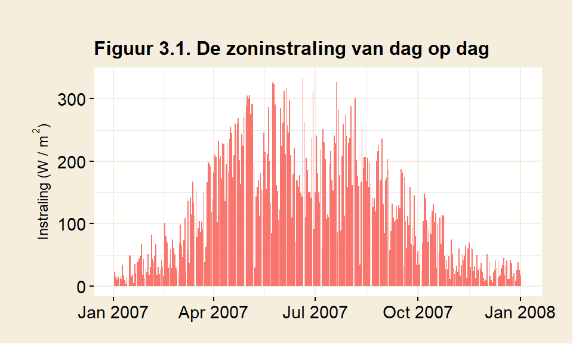
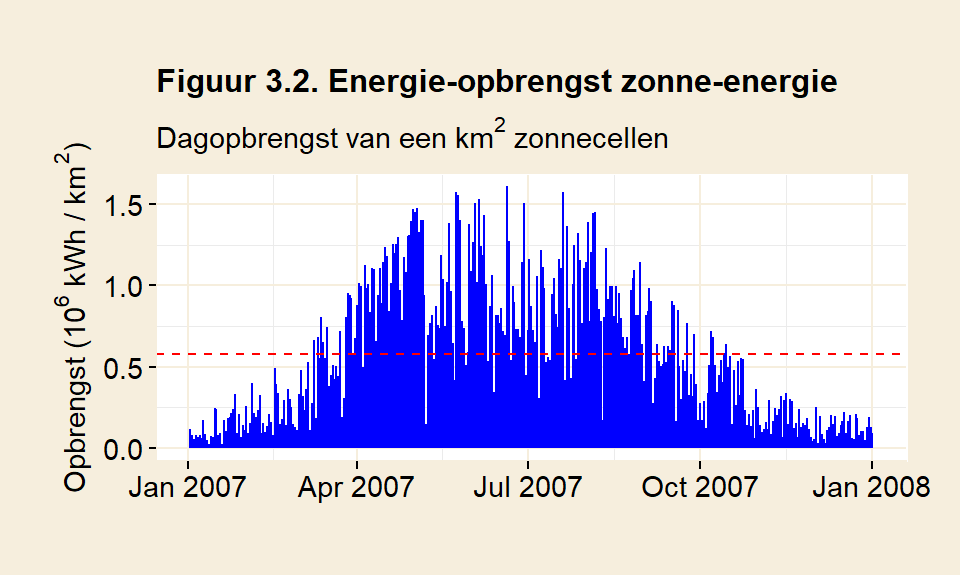
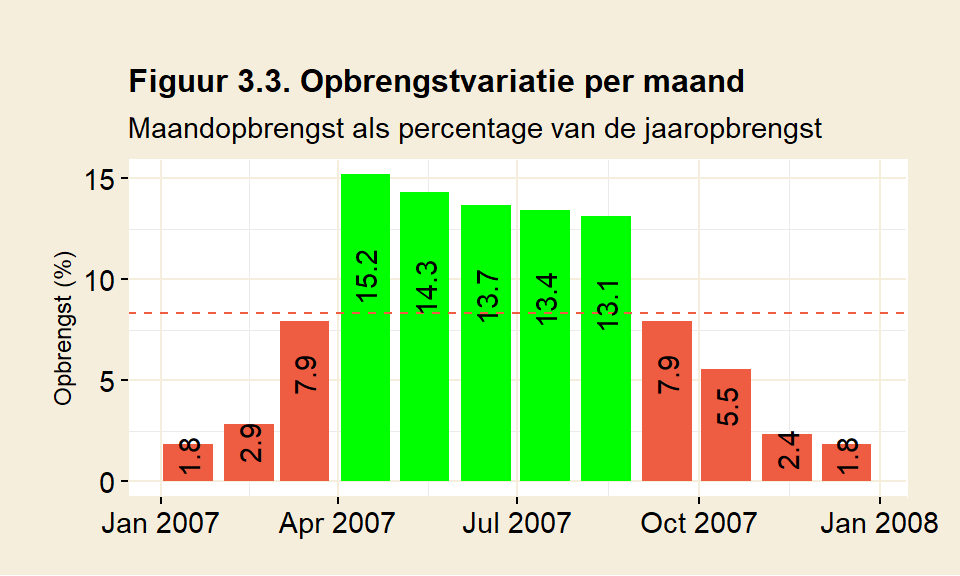
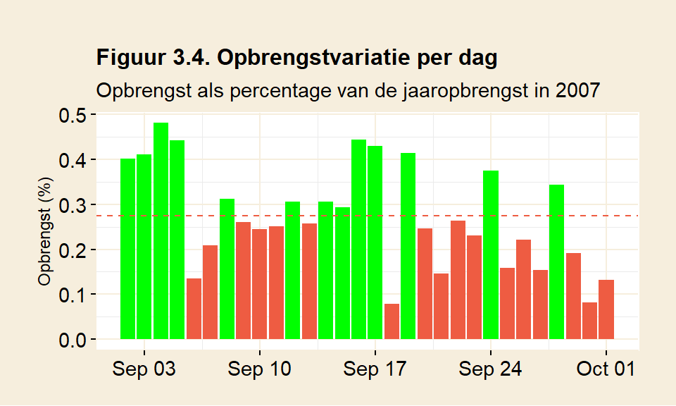
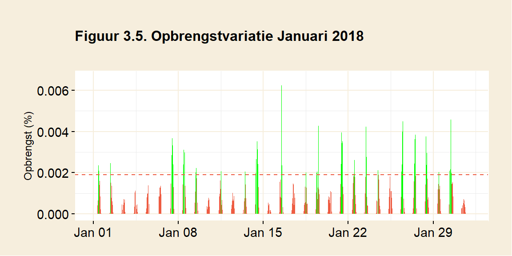
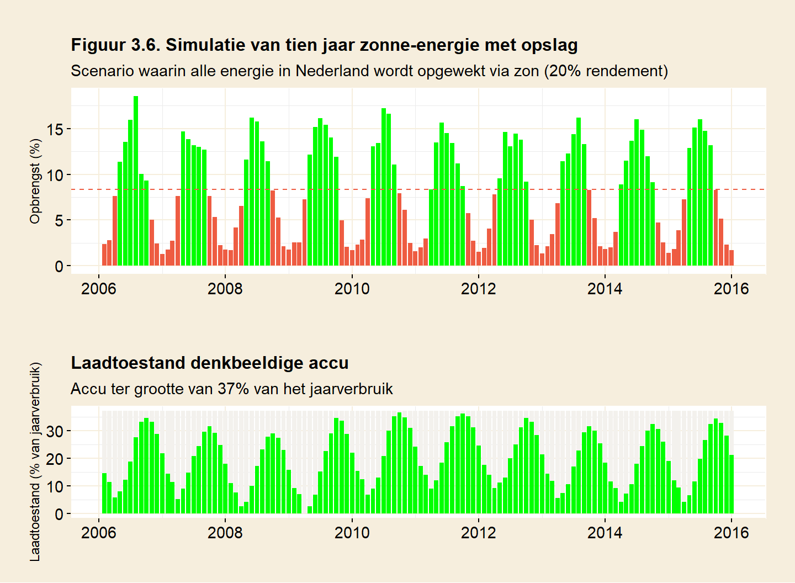
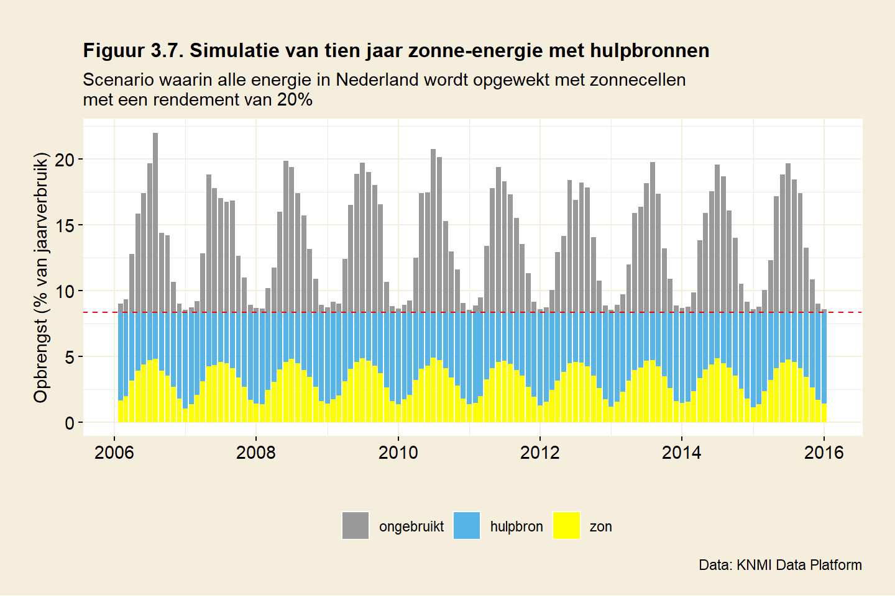

# Zonne-energie

Het doel van dit hoofdstuk is een schatting te geven van de energie-opbrengst en het ruimtegebruik van zonne-energie. Daarnaast wordt gekeken naar de gevolgen van fluctuaties in de opbrengst van zonne-energie. 

## Variatie in zonneschijn

Figuur 3.1 laat op dagbasis zien hoeveel straling Nederland in 2007 ontving, hetzelfde jaar als er bij wind werd gekozen. Het lijkt een jaar te zijn met een vrij slechte zomer (weinig zon), maar het algemene beeld is vergelijkbaar met andere jaren. Op de breedtegraad van Nederland varieert de invalshoek van de zonnestraling gedurende het jaar aanzienlijk. De zon staat hoog aan de hemel in de zomer en laag in de winter. Dat is te zien aan de golfbeweging in de grafiek, die een beetje een sinusoïde vorm heeft. Het seizoenseffect is groot en tegelijkertijd regelmatig. Het andere regelmatige ritme wat betreft de intensiteit van de straling, niet zichtbaar in deze grafiek, is natuurlijk het dag-nachtritme. ’s Nachts is er geen straling te verwachten; op het midden van de dag het meeste. Tot zover is het allemaal heel voorspelbaar.

Figuur 3.1 laat ook zien dat er, hier met name in de zomer, flinke gaten vallen in de hoeveelheid ontvangen zonnestraling. Dat heeft te maken met het weer. Bewolking heeft een grote invloed op de opbrengst van zonnecellen. Als het bewolkt is, is het niet ongewoon dat een zonnecel maar een tiende levert van wat deze in volle zon zou leveren ([MacKay](https://www.withouthotair.com/download.html), p45). Het weer kan dus een grote invloed hebben op de opbrengst van zonnecellen.

## De energie-opbrengst van zonnecellen 

Zonnecellen zetten straling om in elektriciteit. De relatie tussen energie-opbrengst van zonnecellen en de instralingswaarden zoals deze bijvoorbeeld door het KNMI worden gegeven, is betrekkelijk eenvoudig. De opbrengst is gelijk aan het rendement van het zonnepaneel maal de hoeveelheid ingevallen straling. Heeft een bepaald soort zonnecellen bijvoorbeeld een rendement van 20% en is de hoeveelheid ingevallen straling gelijk aan 1100 kWh per m^2^ per jaar, dan zal een vierkante meter van deze zonnecellen in een jaar 220 kWh opbrengen. In tegenstelling tot wind is de relatie tussen straling en opbrengst bij zon lineair. Dat maakt de zaak een stuk eenvoudiger.

Een belangrijke vraag is daarmee welk rendement er voor zonnecellen verwacht mag worden. Een hoger rendement bepaalt de hoeveelheid oppervlak dat voor zonnecellen nodig is. Voor de *variatie* in de opbrengst maakt het niet uit, die blijft hetzelfde of er nu meer of minder efficiënte zonnecellen worden gebruikt. 

Gewone zonnepanelen, zoals die nu beschikbaar zijn, zijn gevoelig voor licht van slechts één bepaalde golflengte (het paneel bestaat uit zogenaamde enkelvoudige of *single-junction* cellen). Het maximaal theoretisch rendement van een enkelvoudige cel is gebonden aan de [Shockley-Queisser limiet](https://en.wikipedia.org/wiki/Shockley%E2%80%93Queisser_limit) van ongeveer 34%. Commerciële cellen halen nu tot 24% rendement. Dat is al dicht in de buurt van de te verwachten praktische limiet van [ongeveer 26%](https://en.wikipedia.org/wiki/Solar_cell).

Er bestaan ook cellen met [meervoudige juncties](https://en.wikipedia.org/wiki/Multi-junction_solar_cell) die een hoger rendement hebben dan cellen met een enkelvoudige junctie. Deze cellen bestaan uit verschillende materialen, waardoor er in principe uit verschillende golflengtes energie kan worden gewonnen. De theoretische limiet, bij een stapeling van een oneindige hoeveelheid lagen, is zo'n 69%. Het beste gerealiseerde rendement tot nu toe is 47%, maar daarbij werd zonlicht geconcentreerd. Het concentreren kost ruimte: een hoger rendement betekent dan ook niet automatisch een hogere opbrengst per vierkante meter. Zie [wikipedia/ solar cell efficiency](https://en.wikipedia.org/wiki/Solar_cell_efficiency) en verdere verwijzingen daarin. 

\bigskip\noindent
Voordat er gesproken kan worden over opbrengst, moet er gekozen worden van welk rendement er moet worden uitgegaan. De keuze zal ergens moeten liggen tussen de theoretische limiet van 69% voor meervoudige zonnecellen en 6% voor goedkope silicium-gebaseerde zonnecellen. Bij de berekeningen hier wordt uitgegaan van (duurdere) zonnecellen met een rendement van 20% (zie ook bijlage B.1 *Berekenen van opbrengst*). Dat zijn zonnecellen met een hoog rendement, weliswaar duur, maar wel algemeen beschikbaar. 

De instralingsgegevens van het KNMI uit figuur 3.1 kunnen gebruikt worden om de opbrengst te berekenen van een vierkante kilometer zonnecellen. Er wordt van uitgegaan dat de zonnecellen tegen elkaar aan geplaatst worden, zonder enige tussenruimte. Figuur 3.2 toont deze energieopbrengst. 

De zonnestraling die Nederland ontvangt is volgens het [KNMI](https://www.knmi.nl/over-het-knmi/nieuws/zonnestraling-in-2019) doorgaans rond 1000 à 1100 kWh per m^2^ per jaar. De berekende jaaropbrengst voor 2007, getoond in figuur 3.2, komt uit op 211 kWh voor een vierkante meter zonnepaneel. Voor een zonnepaneel met een effciëntie van 20% komt dat mooi in de buurt voor een gemiddelde instraling van iets boven de 1000 kWh. Het gebruik van een efficiënter paneel zou de opbrengst in figuur 3.2 verhogen, maar de vorm van de grafiek niet veranderen. Met andere woorden: de hoeveelheid fluctuatie blijft gelijk. 

## Ruimtegebruik

Laten we, net zoals bij windenergie werd gedaan, een denkbeeldig scenario nemen om een inschatting te kunnen maken van de hoeveelheid benodigde ruimte voor zonnecellen. Stel dat alle energie die Nederland gebruikt weer door een duurzame bron wordt opgewekt, ditmaal door zonne-energie.

Net zoals bij wind wordt ook hier weer een periode van 10 jaar gebruikt, van 2006 tot en met 2015. Aan de hand van de gegevens van het KNMI wordt iedere 10 minuten, op basis van de straling in dat tijdsvak, de energie-opbrengst uitgerekend van een vierkante kilometer zonnecellen (belegd met panelen met een rendement van 20%). Als in deze periode van 10 jaar alle opbrengsten bij elkaar worden opgeteld en vervolgens een jaargemiddelde wordt berekend, dan volgt daaruit een opbrengst van 218 miljoen kWh per km^2^.

Dan kan nu worden berekend hoeveel ruimte er nodig zou zijn in een scenario waarbij Nederland al zijn energie opwekt met behulp van de zon. Er wordt daarbij wederom vanuit gegaan dat de panelen zonder tussenruimte tegen elkaar aan geplaatst worden. Het totale energieverbruik van Nederland in 2019 was 706 miljard kWh (zie hoofdstuk 1). 

Hoeveel vierkante kilometer zonnepanelen zou er nodig zijn om het gehele energiegebruik van Nederland te dekken? Daarvoor delen we ons energieverbruik door de opbrengst van zonne-energie per vierkante kilometer:

$$ \frac {706\; miljard \; kWh} {218 \; miljoen \; kWh/km^2} = 3237 \; km^2  $$
\noindent
Deelt men het oppervlak benodigd voor zonnecellen door het oppervlak van Nederland dan blijkt dat 

$$ \frac {3237 \; km^2} {41873 \; km^2} = 7.7 \% $$
\noindent
van Nederland nodig is om ons hele energieverbruik te dekken. Dat is grofweg de grootte van de provincie Zuid-Holland. Daarmee is zonne-energie veel efficiënter dan windenergie. De opbrengst per vierkante kilometer is veel hoger. 

## Opbrengstfluctuaties

De opbrengst van een zonnecel varieert met de hoeveelheid ingevallen straling op een bepaald moment. Bij windenergie bleek deze variatie tot substantiële tekorten te leiden. Hoe zit dat bij zon?  

Figuur 3.3 geeft de opbrengstvariatie weer op maandbasis voor het jaar 2007. De aanname daarbij is weer dat Nederland iedere maand een gelijke hoeveelheid energie gebruikt en de panelen over het hele jaar genomen de vraag dekken. 

Er blijkt een duidelijk seizoenseffect uit figuur 3.3. Het is een beetje een ongewoon jaar in de zin dat de meeste opbrengst niet in juni en juli valt, hetgeen aangeeft dat ook weersinvloeden een factor van belang zijn. In tegenstelling tot wind is hier zoals verwacht de zomer de beste periode. In de winter zakt de opbrengst daarentegen tot ver onder het gemiddelde. Januari brengt 1.8% op, dat is 78% minder dan gemiddeld. Mei is een maand met overvloed, hier kan 72% meer dan gemiddeld worden geproduceerd.

Figuur 3.3 maakt de seizoensinvloeden inzichtelijk, maar de opbrengstvariatie die binnen een maand optreedt blijft verborgen. Figuur 3.4 toont de opbrengst op dagbasis voor de maand september in 2007. In totaal had deze maand een (bijna) gemiddelde opbrengst, dus in principe dekkend voor het energieverbruik in die maand. 

Figuur 3.4 laat echter zien dat de maand september zelf op dagbasis nog aanzienlijke variatie kende. In deze september waren er 6 dagen waar er ruim 50% meer dan gemiddeld kon worden geproduceerd. Omgekeerd kwam er op 4 dagen in deze maand minder dan de helft van het gemiddelde binnen. 

### Zonarme maanden

De grootste tekorten zijn te verwachten in maanden met weinig zon. Dat is doorgaans in de winter. Figuur 3.5 laat januari van 2018 zien. Aan het wit onder de stippellijn is te zien dat er een groot tekort aan zon is. Er zijn in de hele maand slechts 46 uren waarin de zon voldoende opbrengt om aan de vraag te voldoen. Januari telt in totaal 744 uren. Dat betekent dat er 94% van de tijd een tekort is.

Net zoals dat bij wind het geval was, blijkt ook bij zon dat vraag en aanbod niet goed op elkaar zijn afgestemd. Dat tekort is vooral 's nachts en in de winter groot, maar ook een bewolkte dag kan voor een tekort zorgen. De tekorten zijn dieper en langer dan bij windenergie. Ook hier zullen deze moeten worden opgevangen om de energievoorziening op peil te houden. 

## Fluctuaties opvangen met opslag

De variatie in opbrengst van zonne-energie kan, net zoals dat bij windenergie werd gedaan, met behulp van een vorm van energie-opslag vereffend worden. Eerst maar kijken naar opslag. Figuur 3.6 simuleert de opbrengst van zonne-energie voor een periode van tien jaar, gebaseerd op de tienminutendata van het KNMI. De hoeveelheid zonnecellen wordt weer zodanig gekozen dat de totaalopbrengst gelijk is aan het nationaal verbruik. 

Zowel de productie van energie in het bovenste staafdiagram als het verloop van de laadtoestand in het onderste staafdiagram vertonen grote regelmaat. Het is opvallend dat het patroon zo regelmatig is, veel regelmatiger dan voor windfluctuaties het geval was. Op maandbasis is de zoninstraling redelijk voorspelbaar (alhoewel er op dagbasis aanzienlijke variatie is). 

In de onderste figuur wordt de laadtoestand weergegeven van een denkbeeldige accu. Deze denkbeeldige accu heeft een capaciteit ter grootte van 37% van het jaarlijks Nederlands energieverbruik. Dat is precies voldoende om in deze tien jaar alle zonarme perioden op te kunnen vangen. De accu volgt het ritme van de seizoenen. In de late zomer is de accu op z'n volst en in de winter wordt de laagste stand bereikt.  

Merk op dat in 2009 de laadtoestand even de 0% raakt: de accu is nu helemaal leeg. Kleiner kan de accu dus niet zijn, anders onstaat er een energietekort. De capaciteit van de accu in deze simulatie komt overeen met 37% van het jaarverbruik. Dat is gelijk aan ongeveer vier maanden Nederlands energiegebruik. 

## Zonne-energie in combinatie met een hulpbron

Vervolgens kan er gekeken worden naar dezelfde periode van tien jaar met dezelfde fluctuaties in opbrengst, maar ditmaal wordt er gebruik gemaakt van een hulpbron om de tekorten op te vangen. Figuur 3.7 toont weer maandtotalen, gebaseerd op tijdsvakken van 10 minuten. 

\noindent
Het volgende beeld onstaat. Door energie bij te draaien wordt iedere maand inderdaad precies aan de energiebehoefte van Nederland voldaan. Zonne-energie (geel) en hulpbron (blauw) tezamen reiken tot de stippellijn: het verbruik van Nederland. Tevens is te zien dat er zonne-energie onbenut blijft, de grijze staven. Dat komt omdat in een scenario met enkel een hulpbron, dus zonder opslag, deze energie niet inzetbaar is. Het verlies van 'nuttige' capaciteit is groot.

Wie figuur 3.6 vergelijkt met 3.7, valt het misschien op dat de overproductie in 3.7 wel groter lijkt dan het surplus in figuur 3.6. Bij de telling in figuur 3.7 wordt er onderscheid gemaakt tussen tijdsvakken met een overschot en tijdsvakken met een tekort. In figuur 3.7 is de optelling van de gele staven en de grijze staven gelijk aan de hoogte van maandstaven in figuur 3.6. Dit onderscheid ontbreekt in figuur 3.6. De extra informatie die figuur 3.7 biedt, maakt duidelijk hoeveel van de opbrengst surplus was, en hoeveel direct aan gebruikers geleverd kon worden.         

Zonne-energie zorgt in totaal voor 38% van de jaarlijkse energie en de hulpbron moet dus 62% van de benodigde energie bijdraaien.

Ook hier geldt, net zoals werd geconstateerd bij windenergie, dat op momenten dat de zon niet schijnt, de hulpbron de totale last van de energievraag op z'n schouders krijgt. De hulpbron moet ook hier het vermogen hebben om de nationale vraag te dekken en nis daarmee op zichzelf ook dekkend voor onze energiebehoefte.  
 

