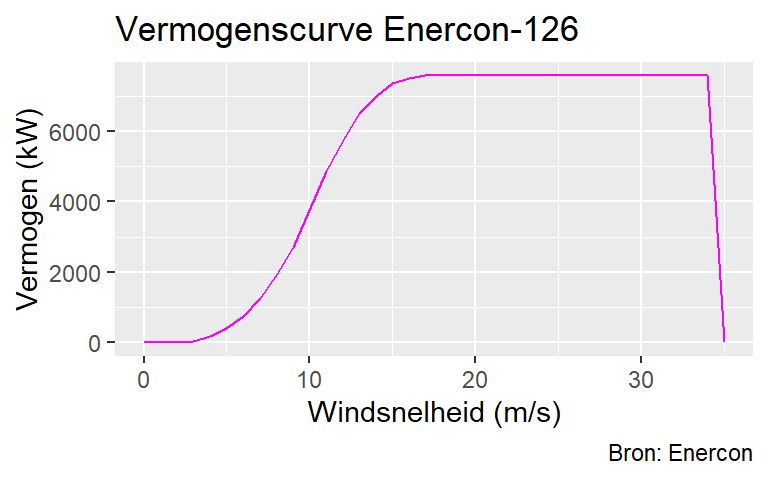

# (APPENDIX) Appendix {-}

# Windenergie

## Een volmaakte windmolen

\bigskip
Een enkele, 'volmaakte' windmolen haalt het theoretisch maximum aan energie uit de langsstromende lucht. De hoeveelheid bewegingsenergie die lucht bevat is afhankelijk van de windsnelheid $v$ en de luchtdichtheid $\rho$ (1,3 kg/m^3^). Bewegende lucht die stroomt door een vierkante meter heeft een vermogen dat gelijk is aan 

$$ \frac{1}{2} \rho v^3 $$
\noindent
Watt (zie bijvoorbeeld [MacKay](https://www.withouthotair.com/download.html)). Een windmolen met grotere wieken vangt meer wind en zal daardoor meer vermogen leveren. De oppervlakte die de wieken beslaan, een cirkel met een diameter $d$, is gelijk aan $\pi (\frac{1}{2} d)^2$.  De stromende lucht door het oppervlak van de wieken kan dus een maximaal vermogen leveren van

$$ \frac{1}{2} \rho v^3 \times \pi  (\frac{1}{2} d)^2 = \frac{1}{2} \rho v^3 \; \frac{\pi}{4} d^2$$
\noindent
Watt. De molen zelf onttrekt energie aan de bewegende lucht en de lucht vertraagt daarmee. Zou je alle energie uit de lucht halen, dan waait het niet meer. En als het niet waait dan draait de molen niet meer. Er zit dus een maximum aan de hoeveelheid energie die men uit stromende lucht kan onttrekken.

\medskip
Een ander effect van de luchtvertraging is dat je windmolens niet te dicht bij elkaar kunt zetten. Ze hebben dan teveel last van elkaars windschaduw. Windparken houden doorgaans een afstand aan van tussen de [6-10 wiekdiameters](https://en.wikipedia.org/wiki/Wind_turbine#Wind_turbine_spacing). Een windmolen bezet een landoppervlakte van $(sd)^2$ m^2^, waarbij $s$ de separatieafstand in wiekdiameters is. Als we ons nu afvragen hoeveel vermogen er door een windmolen per m^2^ landoppervlak kan worden gegenereerd, dan blijkt de diameter van de wieken weg te vallen (zie ook [MacKay](https://www.withouthotair.com/download.html)):

$$ \frac{\frac{1}{2} \rho v^3 \frac{\pi}{4} d^2}{(sd)^2} = \; \frac{\pi}{8s^2} \; \rho v^3 $$
\noindent
De spanwijdte maakt dus niet uit! Grotere windmolens leveren meer vermogen, maar ze moeten ook verder uit elkaar geplaatst worden dan kleine molens. Het geleverde vermogen per vierkante meter is slechts afhankelijk van de windsnelheid en hoe ver de molens uit elkaar geplaatst worden.  

\medskip
Een windmolen kan niet alle beschikbare kinetische energie die in wind zit onttrekken. Volgens de [wet van Betz](https://nl.wikipedia.org/wiki/Wet_van_Betz) kan maximaal 59% van deze energie worden omgezet. Een betere efficiëntie is niet haalbaar, hoe goed de windmolen ook ontworpen wordt. Een volmaakte molen heeft daarmee een opbrengst van 

$$  59\% \times \frac{\pi}{8s^2} \; 1.3 v^3\approx \frac{0.3\;v^3}{s^2} \;  $$
Watt per m^2^. We kunnen dus onafhankelijk van de grootte van de windmolen zeggen welke opbrengst we mogen verwachten als we uitgaan van een volmaakte windmolen. 

\bigskip
Tot nu toe geeft de afgeleide formule de theoretische energie-opbrengst weer van een vierkante meter in een windmolenpark. Windmolens hebben echter last van elkaars windschaduw en met deze verliezen werd nog niet rekening gehouden. Hoe groot zijn deze verliezen?  

\medskip
Uit onderzoek van [Meyers & Meneveau](https://www.researchgate.net/publication/230284417_Optimal_turbine_spacing_in_fully_developed_wind_farm_boundary_layers) blijkt dat windmolens die in een windpark zijn opgesteld veel turbulentie veroorzaken. Deze turbulentie zorgt voor een aanzienlijke vermindering van de opbrengst. Dit zorgt er voor dat de energie-opbrengst van een molen in een windpark minder is dan die van een alleenstaande molen. 

\medskip
De figuur hieronder, overgenomen uit [Meyers & Meneveau](https://www.researchgate.net/publication/230284417_Optimal_turbine_spacing_in_fully_developed_wind_farm_boundary_layers), toont het verband tussen efficiëntie en afstand. De figuur geeft vermogen van een molen staande in een oneindig windpark weer, ten opzichte van het vermogen van een alleenstaande molen. Het genormaliseerde vermogen is afgezet tegen de onderlinge afstand $s$ in wiekdiameters.  

(\#fig:unnamed-chunk-1)Efficiëntie ten opzichte van separatie-afstand

\medskip
De theoretische benadering van [Meyers & Meneveau](https://www.researchgate.net/publication/230284417_Optimal_turbine_spacing_in_fully_developed_wind_farm_boundary_layers) wordt bevestigd door metingen aan windparken in de praktijk. De driehoeken in de figuur geven metingen weer van Horns Rev, een windpark op zee in Denemarken ($s=7$). Horns Rev haalt een efficiëntie van 60% ten opzichte van een alleenstaande molen ($P_\infty=0.6P$). Pas bij een afstand van 100 maal de wiekdiameter nadert de efficiëntie de 100%. Het onderzoek pleit voor een afstand van minimaal 15; volgens de grafiek is de efficiëntie dan zo rond de 80%. Dat is een afstand die windparken in de praktijk op dit moment bij lange na niet hanteren.  

\medskip
Dit verlies aan opbrengst moet worden verrekend. Het opwekken van grote hoeveelheden windenergie vereist de plaatsing van molens in windparken. De formule wordt daarom uitgebreid. De energie-opbrengst wordt vermenigvuldigd met de verwachte efficiëntie $e_s$ van een windpark met molens:  

$$  e_s \; \frac{0.3\;v^3}{s^2}  $$
De efficiëntie van een windmolenpark wordt dan aan de hand van de gekozen separatieafstand opgezocht in de figuur van Meyers & Meneveau. 

## Windmolens in de praktijk

\bigskip
Een [windmolen](https://en.wikipedia.org/wiki/Wind_turbine) wordt [ontworpen](https://en.wikipedia.org/wiki/Wind_turbine_design) op het snelheidsbereik waarvan men de hoogste opbrengst verwacht. Buiten dat bereik is deze minder efficiënt. De onderstaande figuur geeft de vermogenscurve weer voor de Enercon-126, in magenta, zoals deze door de fabrikant wordt verstrekt. Tevens is de theoretische vermogenscurve weergegeven, in blauw, zodat beide met elkaar vergeleken kunnen worden. Een aantal dingen vallen op. 

\medskip
De opbrengst van de Enercon ligt altijd lager dan de theoretische. Dat is natuurlijk de verwachting, want meer dan het theoretisch maximum kan men niet halen. De aard van beide curven is anders: waar het vermogen in theorie blijft stijgen bij toenemende windsnelheid, wordt de curve van een echte windmolen op een goed moment afgekapt. De Enercon komt tot een windsnelheid van 10 m/s goed mee met de theorie. Dit is het snelheidsbereik waarop de molen effectief is. Als men leest over de efficiëntie van windmolens - die halen tegenwoordig 80% - dan is dat over dit snelheidsbereik. Boven de 15 m/s neemt het vermogen niet meer toe, en tussen de 25 en 35 m/s wordt de molen uitgeschakeld. Hier levert de molen bij lange na niet wat theoretisch verwacht zou worden. 

\medskip
In de figuur naast de vermogenscurven bevindt zich een frequentiediagram van de windsnelheid. Het geeft aan hoe vaak een bepaalde windsnelheid voorkomt. Te zien is dat winsnelheden boven de 10 m/s relatief zeldzaam zijn. Het is waarschijnlijk geen toeval dat Enercon-126 ontworpen is effectief te zijn tot zo'n 10 m/s. 

\medskip
Via numerieke integratie, de aanpak die hier wordt gebruikt, is te benaderen wat de opbrengstverschillen zijn. Telt men de opbrengsten over een langere periode (10 jaar) op, dan brengt de Enercon-126 in Nederland ongeveer de helft op van wat men theoretisch zou verwachten. Er is dus een groot verschil in opbrengst tussen theorie en praktijk. Met het huidige ontwerp van windmolens, die worden ontworpen op een bepaald snelheidsbereik, is niet te verwachten dat deze de theorie in de toekomst gaan benaderen. 

\bigskip

## Berekenen van opbrengst

\bigskip
Mocht dat in de toekomst wel lukken, dan geldt er echter een *trade-off*. Als een windmolen het theoretisch maximum nadert, dan kan de molen per definitie beter gebruik maken van windvlagen, van hogere windsnelheden. Dat betekent ook dat daarmee de energie-opbrengst meer fluctueert. Deze fluctuaties zal men moeten opvangen. Het omgekeerde geldt ook: als een windmolen minder efficient is en minder goed energie kan halen uit hogere windsnelheden, dan zijn de fluctuaties minder. Dat gaat echter ten koste van de opbrengst en dat betekent dat men meer ruimte nodig heeft om molens te plaatsen. 

\medskip
De bedoeling is hier om een realistische benadering te geven van de energie-opbrengst van een vierkante kilometer bezet met windmolens. Er worden hier twee benaderingen uitgewerkt: een theoretische en een praktische. 

\medskip
Voor de theoretische benadering kan men uitgaan van de gemiddelde windsnelheid over een lange periode (zeg 10 jaar). Vervolgens kan deze worden gebruikt in de afgeleidde formule ($P = e_s \; \frac{0.3\;v^3}{s^2}$). Dat is de benadering die bijvoorbeeld [MacKay](https://www.withouthotair.com/download.html) heeft gekozen. Voor een realistische schatting van energie-opbrengst heeft dat echter serieuze nadelen. 

Volgens de formule verhoudt de opbrengst zich met de windsnelheid tot de derde macht. Het probleem met windsnelheid middelen over een langere periode is dat de opbrengst wordt onderschat. De gemiddelde windsnelheid in een maand tot de derde macht is kleiner dan de som van de dagelijkse windsnelheden tot de derde macht. Voorbeeld met twee winddagen: $\frac{v_1^3 + v_2^3}{2} \neq (\frac{v_1+v_2}{2})^3$. Neem $v_1=1$ en $v_2=3$, dan volgt $14 \neq 8$. Hoe korter de tijdsperiode is die wordt gehanteerd, hoe groter het uiteindelijke verschil is.  

\medskip
Eenzelfde probleem geldt voor de praktijkbenadering waarbij wordt uitgegaan van de Enercon-126. De opbrengst wordt nu niet bepaald door een theoretische formule, maar door de windsnelheid op te zoeken in de vermogenscurve (power curve) zoals die wordt verstrekt door de leverancier van de molen. Zie ook bijlage A.2 *windmolens in de praktijk*. Deze power curve heeft geen lineair verloop. Ook hier leidt het optellen van de opbrengst bij diverse windsnelheden tot een andere uitkomst dan het opzoeken van de opbrengst bij de gemiddelde windsnelheid. 

\medskip
Om te komen tot een betere schatting van energie-opbrengst, wordt de opbrengst niet berekend aan de hand van de gemiddelde windsnelheid over de gehele periode, maar door tijdsvakken van 10 minuten te gebruiken. Het KNMI heeft [data](https://dataplatform.knmi.nl/dataset/cesar-tower-meteo-lc1-t10-v1-0) beschikbaar die de windsnelheid iedere 10 minuten weergeeft op verschillende plaatsen en hoogten in Nederland. Aan de hand van deze data wordt voor ieder tijdsvak van 10 minuten de energie-opbrengst berekend. 

<table class="table" style="font-size: 10px; margin-left: auto; margin-right: auto;">
<caption style="font-size: initial !important;">(\#tab:datavoorbeeld1)Voorbeeld van opbrengstgegevens</caption>
 <thead>
  <tr>
   <th style="text-align:right;"> Tijd </th>
   <th style="text-align:right;"> Wind (m/s) </th>
   <th style="text-align:right;"> Betz (W/m2) </th>
   <th style="text-align:right;"> Enercon-126 (W/m2) </th>
   <th style="text-align:right;"> Opbrengst Betz (kWh/km2) </th>
   <th style="text-align:right;"> Opbrengst Enercon-126 (kWh/km2) </th>
  </tr>
 </thead>
<tbody>
  <tr>
   <td style="text-align:right;"> 2007-04-01 00:00:00 </td>
   <td style="text-align:right;width: 2cm; "> 12.4 </td>
   <td style="text-align:right;width: 2cm; "> 7.00 </td>
   <td style="text-align:right;width: 2cm; "> 4.67 </td>
   <td style="text-align:right;width: 2cm; "> 1167.32 </td>
   <td style="text-align:right;width: 2cm; "> 777.71 </td>
  </tr>
  <tr>
   <td style="text-align:right;"> 2007-04-01 00:10:00 </td>
   <td style="text-align:right;width: 2cm; "> 11.7 </td>
   <td style="text-align:right;width: 2cm; "> 5.88 </td>
   <td style="text-align:right;width: 2cm; "> 4.23 </td>
   <td style="text-align:right;width: 2cm; "> 980.58 </td>
   <td style="text-align:right;width: 2cm; "> 704.44 </td>
  </tr>
  <tr>
   <td style="text-align:right;"> 2007-04-01 00:20:00 </td>
   <td style="text-align:right;width: 2cm; "> 10.9 </td>
   <td style="text-align:right;width: 2cm; "> 4.76 </td>
   <td style="text-align:right;width: 2cm; "> 3.66 </td>
   <td style="text-align:right;width: 2cm; "> 792.87 </td>
   <td style="text-align:right;width: 2cm; "> 609.31 </td>
  </tr>
  <tr>
   <td style="text-align:right;"> 2007-04-01 00:30:00 </td>
   <td style="text-align:right;width: 2cm; "> 10.8 </td>
   <td style="text-align:right;width: 2cm; "> 4.63 </td>
   <td style="text-align:right;width: 2cm; "> 3.57 </td>
   <td style="text-align:right;width: 2cm; "> 771.25 </td>
   <td style="text-align:right;width: 2cm; "> 595.17 </td>
  </tr>
  <tr>
   <td style="text-align:right;"> 2007-04-01 00:40:00 </td>
   <td style="text-align:right;width: 2cm; "> 10.8 </td>
   <td style="text-align:right;width: 2cm; "> 4.63 </td>
   <td style="text-align:right;width: 2cm; "> 3.57 </td>
   <td style="text-align:right;width: 2cm; "> 771.25 </td>
   <td style="text-align:right;width: 2cm; "> 595.17 </td>
  </tr>
</tbody>
</table>

\bigskip
Voor langere perioden wordt de opbrengst gesommeerd, bijvoorbeeld de dagopbrengst is gelijk aan de som van de 144 vakken van 10 minuten in die dag. De opbrengst wordt zowel berekend door gebruik te maken van de formule (hier 'Betz' genoemd), als door de windsnelheid van iedere 10 minuten op te zoeken in de power curve van de Enercon-126. In tabel 1 is dat gedaan en ziet men enige uitkomsten zoals deze in de berekeningen zijn gebruikt. 

\medskip
De theoretische opbrengst in W/m^2^, de derde kolom ('Betz'), wordt berekend door de windsnelheid in de tweede kolom te nemen en in te vullen in $e_s \; \frac{0.3\;v^3}{s^2}$ in $v$ en voor $s=7$ en $e_s=0.6$ te nemen. De energie-opbrengst wordt berekend door W/m^2^ om te zetten in kWh per km^2^. Voor de Enercon wordt in de power curve (zie bijlage A.2 *windmolens in de praktijk*) de opbrengst in kW bij een bepaalde windsnelheid opgezocht. Dan wordt berekend wat er in kWh wordt geproduceerd op een oppervlak bezet met molens met een separatieafstand van 7 wiekdiameters. De laatste twee kolommen geven die opbrengst in kWh per vierkante kilometer weer voor 'Betz' en de Enercon. 

\bigskip

## Berekenen van lopend tekort

\bigskip
Figuur 4 (zie tekst) geeft de maandelijkse tekorten en overschotten weer voor een windpark ten opzichte van de gemiddelde opbrengst van dat jaar. Het blijkt echter dat er grote maandelijkse verschillen zitten in de windkracht. Er zijn maanden met een overproductie t.o.v. het gemiddelde, en er zijn maanden met een tekort. 

\medskip
Uit figuur 4 blijkt dat in 2007 de maand januari de meeste wind had. In deze maand zou 16,2% van de jaaropbrengst zijn binnengekomen. De zomer daarentegen kent een periode van drie maanden achtereen met tekorten. 

\medskip
In opeenvolgende maanden met tekorten stapelt het tekort zich vervolgens op, omdat de tekorten blijven aanhouden. Laten we eens kijken hoe dat in 2007 uitpakt. In 2007 was er van januari tot en met maart ruim voldoende wind voorhanden om aan de vraag te voldoen. Oktober daarentegen had een groot tekort. In die maand was er een tekort van 8,3% - 4,6% = 3,7% van de jaarlijkse energiebehoefte. Dat is dus een tekort van 45% (3,7 / 8,3 = 0,45) op maandbasis. Dat (lopende) tekort wordt de maand daarop in mei niet teruggewonnen, ondanks dat het een windrijke maand was. In juni, de maand daarna, verdiept het tekort verder. In totaal ontstaat er in 2007 zo een tekort dat oploopt tot (8,3-5,6) + (8,3-7,5) + (8,3-4,7) + (8,3-7,2) + (8,3-5,4) + (8,3-6,9) + (8,3-4,6) = 16,5% van de opbrengst in dat jaar.

\medskip
In dit voorbeeld werden tekorten berekend aan de hand van maandopbrengsten. Een jaar heeft slechts 12 maanden, dus het blijft overzichtelijk en er valt gemakkelijk uit de grafiek te tellen. Het is wel een enigzinds grove telling zo. Naarmate het tijdsinterval afneemt zal het gemeten tekort toenemen. Immers, een maand die gemiddeld genoeg opbrengst heeft, kan best zijn begonnen met twee weken windstilte. Die windstilte blijft onzichtbaar, maar had eigenlijk bij een eventueel lopend tekort van vorige maanden moeten worden opgeteld. Om een betere benadering van het maximale tekort te krijgen worden de energietekorten elders in de tekst in tijdsvakken van 10 minuten berekend.

# Zonne-energie

## Berekenen van opbrengst

\medskip
Om de opbrengst van zonnecellen te berekenen wordt stralingsdata van het KNMI gebruikt, gemeten nabij meetmast Cabauw, midden in het land. De data geeft voor het tijdsvak van 10 minuten de gemiddelde globale straling in Watt per vierkante meter. Aan de hand van deze data wordt voor ieder tijdsvak van 10 minuten de energie-opbrengst berekend. Voor langere perioden wordt de opbrengst gesommeerd, bijvoorbeeld de dagopbrengst is gelijk aan de som van de 144 vakken van 10 minuten in die dag. In tabel B.1 ziet men enige uitkomsten zoals deze in de berekeningen zijn gebruikt. 

<table class="table" style="font-size: 10px; margin-left: auto; margin-right: auto;">
<caption style="font-size: initial !important;">(\#tab:datavoorbeeld2)Voorbeeld van opbrengstgegevens</caption>
 <thead>
  <tr>
   <th style="text-align:right;"> Tijd </th>
   <th style="text-align:right;"> straling (W/m2) </th>
   <th style="text-align:right;"> Opbrengst zonnecel (kWh/km2) </th>
  </tr>
 </thead>
<tbody>
  <tr>
   <td style="text-align:right;"> 2007-04-01 09:50:00 </td>
   <td style="text-align:right;width: 2cm; "> 575.48 </td>
   <td style="text-align:right;width: 2cm; "> 19182.72 </td>
  </tr>
  <tr>
   <td style="text-align:right;"> 2007-04-01 10:00:00 </td>
   <td style="text-align:right;width: 2cm; "> 589.89 </td>
   <td style="text-align:right;width: 2cm; "> 19662.86 </td>
  </tr>
  <tr>
   <td style="text-align:right;"> 2007-04-01 10:10:00 </td>
   <td style="text-align:right;width: 2cm; "> 597.83 </td>
   <td style="text-align:right;width: 2cm; "> 19927.65 </td>
  </tr>
  <tr>
   <td style="text-align:right;"> 2007-04-01 10:20:00 </td>
   <td style="text-align:right;width: 2cm; "> 608.60 </td>
   <td style="text-align:right;width: 2cm; "> 20286.79 </td>
  </tr>
  <tr>
   <td style="text-align:right;"> 2007-04-01 10:30:00 </td>
   <td style="text-align:right;width: 2cm; "> 620.90 </td>
   <td style="text-align:right;width: 2cm; "> 20696.61 </td>
  </tr>
  <tr>
   <td style="text-align:right;"> 2007-04-01 10:40:00 </td>
   <td style="text-align:right;width: 2cm; "> 630.46 </td>
   <td style="text-align:right;width: 2cm; "> 21015.29 </td>
  </tr>
</tbody>
</table>

\bigskip
In de tekst wordt uitgegaan van zonnepanelen met een rendement van 20%. De opbrengst wordt weergegeven in kilowattuur per vierkante kilometer. De straling wordt door het KNMI in tijdsvakken van 10 minuten weergegeven in watt per vierkante meter (W/m^2^). De berekeningen werken verder met de kilowattuur (kWh), dus de waarde in watt voor de 10 minuten wordt eerst omgezet naar wattuur. Daartoe wordt de waarde van de kolom straling gedeeld door 6: 575,48 W / 6 = 95,91 Wh (per 10 min). Vervolgens wordt er gedeeld door 1.000 om van W naar kW te komen en dan maal een miljoen om van vierkante meter naar vierkante kilometer te komen: (95,5 / 1.000) * 1.000.000 = 95.913,33 kWh/km^2^. Dan, omdat de panelen een efficiëntie van 20% hebben, blijft daar een vijfde van over. Daarmee wordt de uitkomst in de kolom 'opbrengst' verkregen: 95.913,33 * 20% = 19.182,72 kWh/km^2^.     

